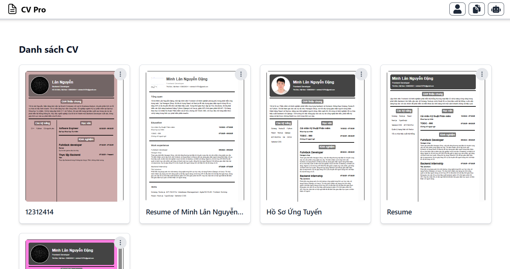
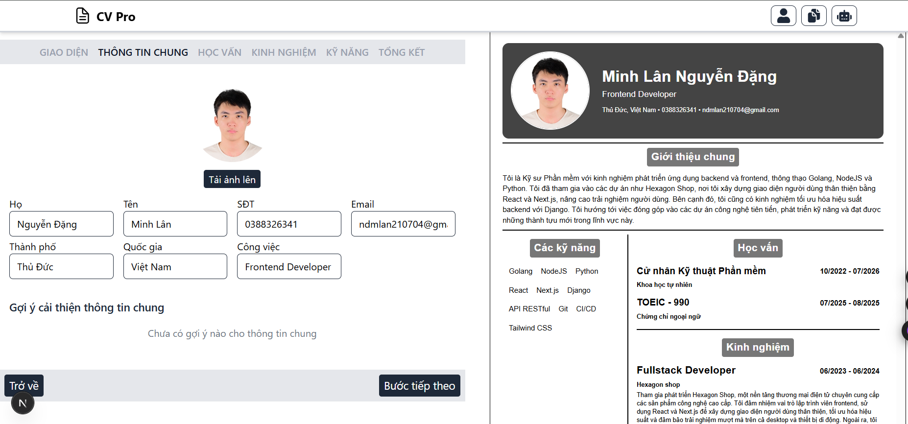
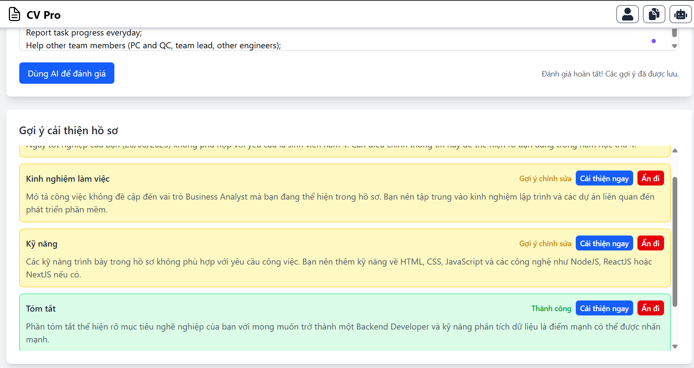

# Ứng dụng Hỗ Trợ Viết CV Tích Hợp AI
## Thông tin thành viên nhóm
- Nguyễn Đặng Minh Lân - 22120183
- Trần Đức Minh - 22120212
- Nguyễn Hữu Nghĩa - 22120227
- Võ Hoàng Nguyên - 22120241

## Giới thiệu

Ứng dụng web giúp người dùng – đặc biệt là sinh viên và người mới đi làm – viết CV chuyên nghiệp, nhanh chóng, dễ tùy chỉnh với sự hỗ trợ của AI (GPT). Người dùng chỉ cần nhập thông tin cơ bản và có thể nhận được nội dung CV được gợi ý một cách tự động, phù hợp với ngành nghề và vị trí ứng tuyển.

## Mục tiêu

- Hỗ trợ người dùng tạo và chỉnh sửa CV một cách dễ dàng.
- Tích hợp AI (GPT API) để sinh nội dung CV từ đầu vào.
- Cho phép chọn mẫu CV, đổi font, màu sắc, bố cục.
- Xem trước và tải xuống CV dưới dạng PDF.

## Tính năng chính

### Nhập và chỉnh sửa thông tin CV

- Người dùng nhập thông tin vào các mục: Học vấn, Kinh nghiệm, Kỹ năng, Hoạt động,...
- Hỗ trợ chỉnh sửa nội dung trực tiếp trong khối (inline editing).

### Sinh nội dung tự động với AI

- Gợi ý đoạn văn cho: Kinh nghiệm làm việc, Kỹ năng, Mục tiêu nghề nghiệp,...
- Tương tác với GPT thông qua API để nhận nội dung phù hợp theo ngữ cảnh.

### Tuỳ chỉnh giao diện

- Chọn mẫu CV (template)
- Đổi font chữ, màu sắc chủ đạo
- Lựa chọn bố cục hiển thị (1 cột, 2 cột,...)

### Xem trước và xuất PDF

- Xem trước bản CV hoàn chỉnh theo mẫu đã chọn.
- Tải CV về máy dưới định dạng PDF.

## Công nghệ sử dụng

- **Frontend:** Next.js (React), Tailwind CSS
- **Backend:** API nội bộ tích hợp trong Next.js
- **AI:** OpenAI GPT (gpt-4.0-mini)
- **Thư viện khác:** react-to-print, prompt engineering

## Kiến trúc hệ thống

Ứng dụng sử dụng mô hình **Client–Server tích hợp**:
- Giao diện người dùng: Xây dựng bằng Next.js với khả năng SSR/SSG.
- API nội bộ: Nhận yêu cầu từ frontend, dựng prompt, gọi OpenAI API.
- AI as a Service: Sử dụng GPT để sinh văn bản.

**Luồng xử lý chính:**

1. Người dùng nhập thông tin CV.
2. Gửi yêu cầu sinh nội dung bằng AI.
3. Backend tạo prompt → gọi GPT API → nhận kết quả.
4. Hiển thị nội dung cho người dùng.
5. Tùy chỉnh và xuất file PDF.

## Bảo mật

- Ẩn API key khỏi phía client, xử lý ở server-side.
- Giới hạn số lần gọi API mỗi phiên.
- Dự kiến tích hợp caching để tiết kiệm chi phí.

## Hạn chế hiện tại

- Chưa có tính năng quản lý tài khoản và lưu trữ CV lâu dài.
- Một số nội dung AI sinh còn chung chung, cần người dùng chỉnh sửa lại.
- Chưa đánh giá được mức độ phù hợp của CV với mô tả công việc cụ thể.
- Gọi API nhiều lần có thể tốn chi phí và gây trễ nếu không tối ưu.

## Định hướng phát triển

- Thêm tính năng đăng ký, đăng nhập, lưu CV và lịch sử.
- Mở rộng bộ template CV, hỗ trợ tùy chỉnh bố cục sâu hơn.
- Đánh giá độ hoàn chỉnh và phù hợp của CV với từng JD.
- Cá nhân hóa prompt theo ngành nghề.
- Tối ưu chi phí API bằng caching/batching hoặc dùng mô hình mã nguồn mở.
- Gợi ý toàn bộ CV theo thông tin đầu vào, không chỉ theo từng mục.

## Setup
1. Install packages.
    ```bash
    npm install
    ```
2. Add ".env" file with format same as ".env.example"
## Run application
- Dev mode
    ```bash
    npm run dev
    ```
- Prod mode (faster)
    ```bash
    npm run build
    npm run start
    ```

## Preview Images




